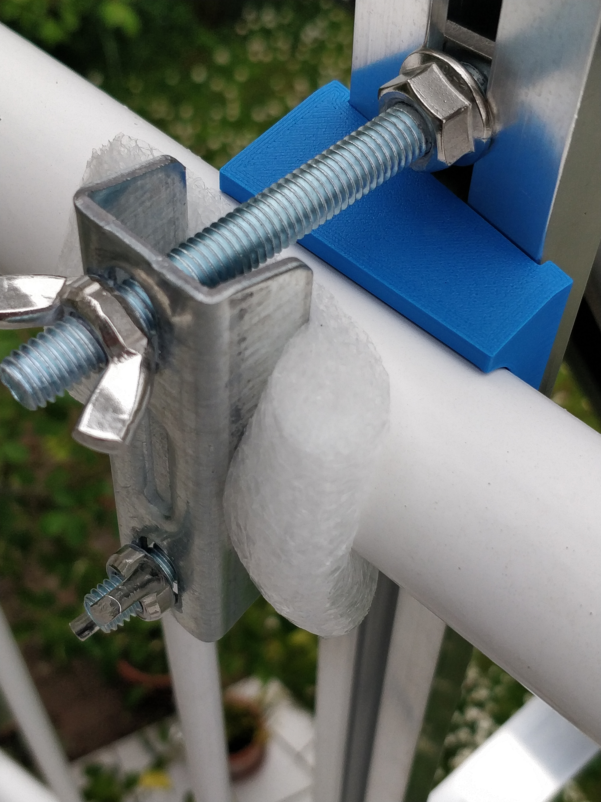
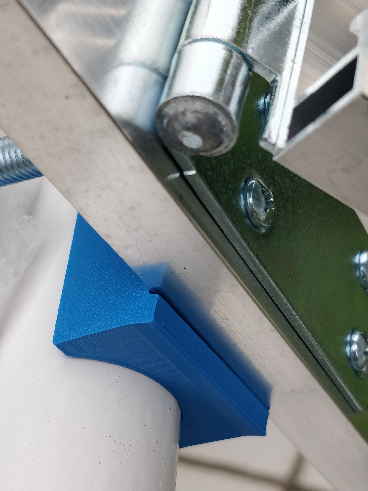

# balkon_solar_gelaender_adapter
Das Befestigungssystem der Balkonsolaranlage von https://yuma.de ist eigentlich für Balkongeländer mit rechtecigem Querschnitt gedacht. Mein Balkongelander hat aber eine Reeling mit kreisförmigem Querschnitt, zusätzlich ist die Reeling kein gerades Rohr, sondern in einem großen Bogen entlang der Balkonkante gekrümmt.

Deshalb habe ich einen Adapter entworfen, der sich einerseits an den Kreis des Geländerquerschnitt ansschmiegt, andererseits den Winkel des Geländerschwungs ausgleicht.

